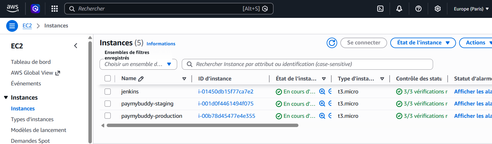
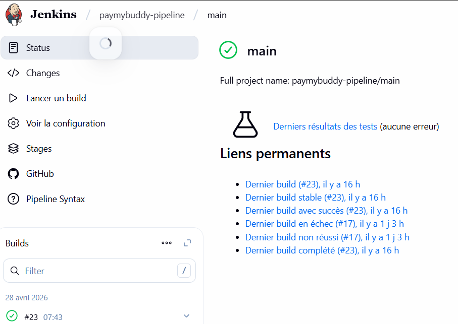
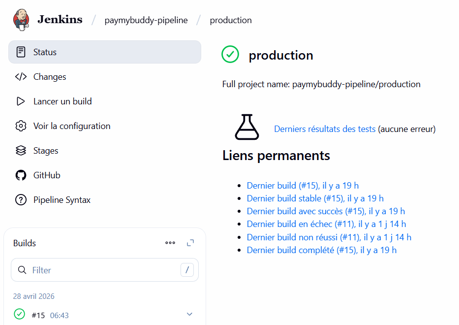
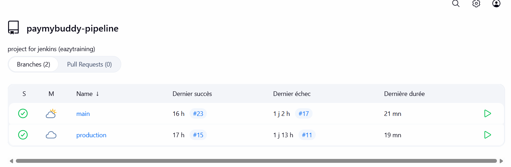
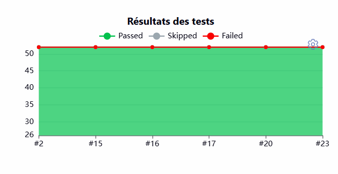
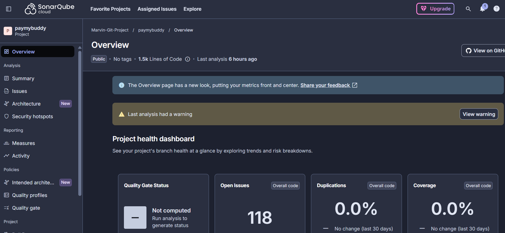
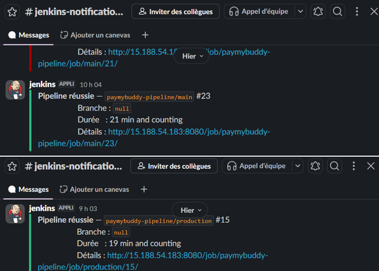
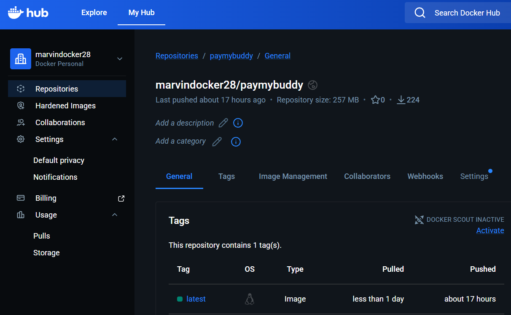
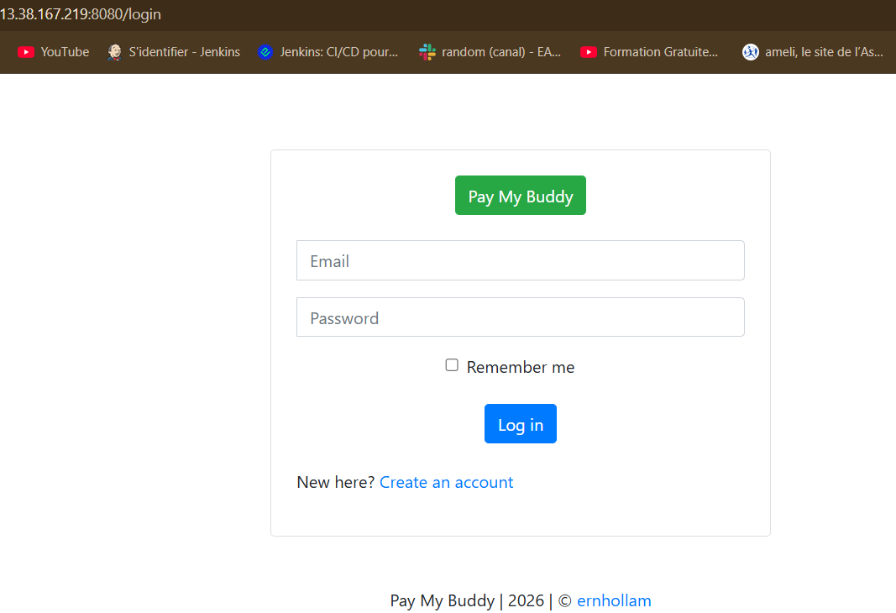
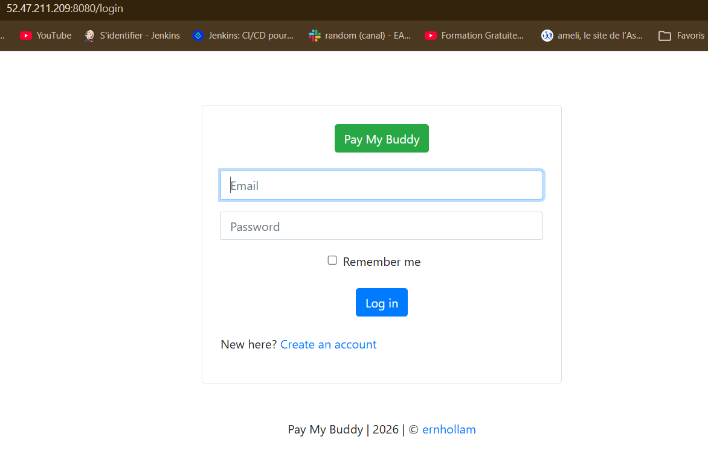

# Projet CI/CD Jenkins — PayMyBuddy

> Pipeline d'intégration et de déploiement continus pour l'application Spring Boot **PayMyBuddy**, déployée sur AWS EC2 avec Jenkins, Docker, SonarCloud et Slack.

---

## Table des matières

- [Architecture](#architecture)
- [Stack technique](#stack-technique)
- [Prérequis](#prérequis)
- [Infrastructure AWS](#infrastructure-aws)
- [Pipeline CI/CD](#pipeline-cicd)
- [Gitflow](#gitflow)
- [Commandes clés](#commandes-clés)
- [Résultats](#résultats)
- [Auteur](#auteur)

---

## Architecture

```
┌─────────────────────────────────────────────────────────────┐
│                        GitHub                               │
│         Repository : Marvin-Git-Project/PayMyBuddy          │
│         Branches   : main / production                      │
└──────────────────────┬──────────────────────────────────────┘
                       │ Webhook (ngrok)
                       ▼
┌─────────────────────────────────────────────────────────────┐
│              VM Jenkins (AWS EC2 — t3.micro)                │
│              IP Elastic : 52.47.126.188                     │
│              Jenkins + Docker + ngrok                       │
└──────┬────────────────────────┬───────────────────────────┘
       │ SSH Deploy             │ SSH Deploy
       ▼                        ▼
┌──────────────────┐    ┌──────────────────┐
│   VM Staging     │    │   VM Production  │
│   t3.micro       │    │   t3.micro       │
│  13.38.167.219   │    │  52.47.211.209   │
│  MySQL + Docker  │    │  MySQL + Docker  │
└──────────────────┘    └──────────────────┘
         │                       │
         └───────────┬───────────┘
                     ▼
           ┌──────────────────┐
           │   Docker Hub     │
           │  marvindocker28  │
           │  /paymybuddy     │
           └──────────────────┘
```

---

## 🛠️ Stack technique

| Outil | Rôle | Version |
|---|---|---|
| **Jenkins** | Serveur CI/CD | 2.520 |
| **Docker** | Containerisation | 29.1.3 |
| **Docker Compose** | Déploiement Jenkins | 1.29.2 |
| **Maven** | Build Java | 3.9.6 |
| **Java** | Langage applicatif | Amazon Corretto 17 |
| **MySQL** | Base de données | 8.x |
| **SonarCloud** | Analyse qualité du code | Cloud |
| **Slack** | Notifications pipeline | Cloud |
| **ngrok** | Tunnel webhook GitHub → Jenkins | 3.x |
| **AWS EC2** | Infrastructure cloud | t3.micro |
| **GitHub** | Gestionnaire de code source | Cloud |

---

## Prérequis

Avant de démarrer l'environnement, s'assurer d'avoir :

- Un compte **AWS** avec 3 instances EC2 opérationnelles (jenkins, staging, production) / (ou équivalent)
- Un compte **Docker Hub** avec un token d'accès Read & Write
- Un compte **SonarCloud** avec le projet `Marvin-Git-Project_PayMyBuddy` configuré
- Un workspace **Slack** avec l'intégration Jenkins CI configurée
- Un compte **ngrok** avec un authtoken configuré
- **MobaXterm** (ou un équivalent) pour se connecter en SSH aux VMs
- Une clé SSH, exemple **`paymybuddy-key.pem`** générée au moment de la création des instancances pour les VMs "staging" et "production"

---

## Infrastructure AWS

### Instances EC2

| Instance | IP Elastic | Usage | Stockage |
|---|---|---|---|
| `jenkins` | `52.47.126.188` | Serveur Jenkins + Docker + ngrok | 40 Go |
| `paymybuddy-staging` | `13.38.167.219` | Environnement de pré-production | 15 Go |
| `paymybuddy-production` | `52.47.211.209` | Environnement de production | 15 Go |

### Ports ouverts (Security Groups)

| Port | Protocole | Usage |
|---|---|---|
| 22 | TCP | SSH |
| 80 | TCP | HTTP |
| 8080 | TCP | Jenkins / Application |

---

## Pipeline CI/CD

### Étapes de la pipeline

```
┌──────────┐   ┌────────────┐   ┌─────────┐   ┌──────────────────┐
│  Tests   │ → │ SonarCloud │ → │ Package │ → │ Docker Build&Push│
└──────────┘   └────────────┘   └─────────┘   └────────┬─────────┘
                                                        │
                                       (main uniquement)│
                                                        ▼
                                              ┌──────────────────┐
                                              │ Deploy to Staging│
                                              └────────┬─────────┘
                                                       │
                                                       ▼
                                              ┌──────────────────┐
                                              │Validate Staging  │
                                              └────────┬─────────┘
                                                       │
                                                       ▼
                                              ┌──────────────────┐
                                              │Deploy to Prod    │
                                              └────────┬─────────┘
                                                       │
                                                       ▼
                                              ┌──────────────────┐
                                              │Validate Prod     │
                                              └────────┬─────────┘
                                                       │
                                                       ▼
                                              ┌──────────────────┐
                                              │Notification Slack│
                                              └──────────────────┘
```

### Description des étapes

**1 — Tests** : Exécution des 52 tests unitaires et d'intégration avec Maven dans un container `maven:3.9.6-amazoncorretto-17`. Les rapports JUnit sont publiés dans Jenkins.

**2 — SonarCloud Analysis** : Analyse statique du code source envoyée vers SonarCloud. Vérifie la qualité, les bugs, les vulnérabilités et la duplication de code.

**3 — Package** : Compilation et packaging de l'application Spring Boot en JAR exécutable via `mvn package -DskipTests`.

**4 — Docker Build & Push** : Construction de l'image Docker à partir du JAR produit, puis push sur Docker Hub sous `marvindocker28/paymybuddy:latest`.

**5 — Deploy to Staging** : Déploiement SSH sur la VM staging. Pull de l'image Docker Hub, lancement du container avec connexion à MySQL local via `--add-host=host.docker.internal:host-gateway`.

**6 — Validate Staging** : Vérification que l'application répond sur `http://13.38.167.219:8080` via `curl`.

**7 — Deploy to Production** : Même processus que le staging, sur la VM production.

**8 — Validate Production** : Vérification que l'application répond sur `http://52.47.211.209:8080` via `curl`.

**Post — Notification Slack** : Envoi d'un message dans `#jenkins-notifications` indiquant le statut final de la pipeline (succès ou échec).

---

## Gitflow

| Branche | Étapes exécutées |
|---|---|
| **`main`** | Tests → Sonar → Package → Docker Build/Push → Deploy Staging → Validate Staging → Deploy Production → Validate Production → Slack |
| **`production`** | Tests → Sonar → Package → Docker Build/Push → Slack (déploiements skippés) |

> Le déploiement sur les VMs n'est déclenché que depuis la branche `main`. La branche `production` sert à valider la qualité du code sans déployer.

---

## Commandes clés

### Démarrer l'environnement Jenkins

```bash
# Se connecter en SSH à la VM Jenkins (pour mon instance Jenkins exemple adresse IPv4 = 52.47.126.188)
ssh -i jenkins-key.pem ubuntu@52.47.126.188

# Lancer Jenkins via Docker Compose
cd ~/jenkins
docker-compose up -d

# Vérifier que Jenkins tourne
docker ps

# Accéder à Jenkins dans le navigateur
# http://52.47.126.188:8080
```

### Lancer le tunnel ngrok (webhook GitHub)

```bash
# Dans un terminal dédié sur la VM Jenkins
ngrok http 8080

# L'URL générée (ex: https://xxxx.ngrok-free.app) doit être
# configurée dans GitHub → Settings → Webhooks → Payload URL
# sous la forme : https://xxxx.ngrok-free.app/github-webhook/
```

### Vérifier MySQL sur staging et production

```bash
# Connexion SSH à la VM staging (dans mon cas IP staging = 13.38.167.219 )
ssh -i paymybuddy-key.pem ubuntu@13.38.167.219

# Vérifier que MySQL tourne
sudo systemctl status mysql

# Vérifier la base de données
sudo mysql -e "SHOW DATABASES;"

# Si besoin, recréer la configuration MySQL
sudo mysql -e "CREATE DATABASE IF NOT EXISTS db_paymybuddy;"
sudo mysql -e "CREATE USER IF NOT EXISTS 'root'@'%' IDENTIFIED BY 'password';"
sudo mysql -e "GRANT ALL PRIVILEGES ON db_paymybuddy.* TO 'root'@'%';"
sudo mysql -e "FLUSH PRIVILEGES;"
```

### Configuration MySQL après redémarrage des VMs

Après chaque redémarrage d'une VM staging ou production, vérifier que
MySQL accepte les connexions depuis Docker :

```bash
# Vérifier le bind-address
grep bind-address /etc/mysql/mysql.conf.d/mysqld.cnf
# Doit afficher : bind-address = 0.0.0.0

# Si ce n'est pas le cas, modifier le fichier
sudo nano /etc/mysql/mysql.conf.d/mysqld.cnf
# Changer : bind-address = 127.0.0.1
# En :      bind-address = 0.0.0.0

# Redémarrer MySQL
sudo systemctl restart mysql
```

### Libérer de l'espace disque sur Jenkins 

```bash
# Se connecter à la VM Jenkins
ssh -i jenkins-key.pem ubuntu@52.47.126.188

# Nettoyer les images Docker inutilisées
docker system prune -af --volumes

# Vérifier l'espace disque
df -h /
```

### Déclencher un build manuellement (en dehors de l'interface Jenkins | directement sur un terminal GIT)

```bash
# Depuis le repo local PayMyBuddy
git checkout main
echo "trigger" >> README.md
git add .
git commit -m "trigger pipeline"
git push origin main
# Jenkins détecte le push via webhook et lance automatiquement la pipeline
```

### Credentials Jenkins nécessaires

| ID Jenkins | Type | Usage |
|---|---|---|
| `dockerhub` | Username/Password | Push image Docker Hub |
| `sonar_token` | Secret text | Analyse SonarCloud |
| `slack_token` | Secret text | Notifications Slack |
| `ssh_staging` | SSH Username/Private key | Déploiement staging |
| `ssh_prod` | SSH Username/Private key | Déploiement production |

---

## Résultats

### Instances AWS EC2


### Pipeline Jenkins branche `main` au vert


### Pipeline Jenkins branche `production` au vert


### Vue d'ensemble des 2 branches


### Résultats des 52 tests


### Dashboard SonarCloud


### Notification Slack


### Image Docker Hub


### Application en staging


### Application en production


---

## Auteur

Projet réalisé par **Marvin-Git-Project**
Dans le cadre d'un bootcamp proposé par **Eazytraining**
